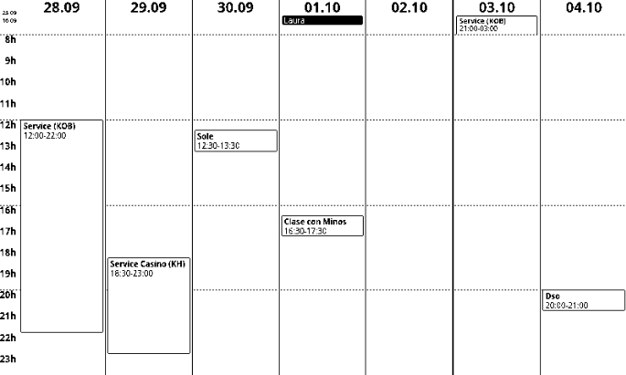
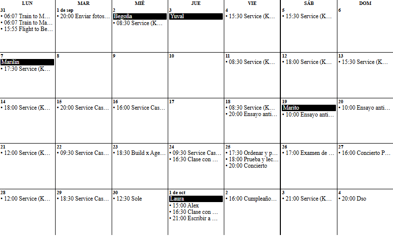

# Multi-calendar plugin for TRMNL

A TRMNL plugin that merges one or more ICS calendars and pushes pre-rendered views
sized for the 7.5" display (800×480): the current week, the next week and the full month.

| Week | Month |
|---|---|
|  |  |

## How it works

- Every ICS in `TRMNL_ICS_URL` is downloaded, merged and expanded (recurring events included).
- Each view is rendered as a fixed 800×480 block of HTML and sent to its own TRMNL webhook as the
  `calendar_html` merge variable. TRMNL only has to print it, see [`template.html`](template.html).
- **Week views** show the natural week, Monday to Sunday, of the current date in `TRMNL_TZ`.
  The "current week" switches to the new week on Monday at 00:00 local time, and "next week"
  moves one week forward with it.
- **Week grid**: it covers 08:00 to 23:59, with one label per hour and a dashed line every 4 hours
  (08h, 12h, 16h and 20h). Timed events inside that range are drawn on the grid. Events outside it,
  including overnight events that end before 08:00, are shown as badges above the grid together with
  the all-day events. This is by design, and the range can be changed, see
  [Customizing the week grid](#customizing-the-week-grid).
- **Month view** shows the full weeks that overlap the month.
- Times are shown in `TRMNL_TZ`, whatever timezone the calendar uses.
- The script only pushes a view when its content changed since the last successful push
  (fingerprints are stored in `.push_state.json`). The small date/time in the week view is therefore
  the time of the last push, not of the last check.

The views use the whole screen, so they only work with the **Full** layout. The half and quadrant
mashup layouts are not supported.

## Setup

1. At TRMNL, add a Private Plugin **for each view** you want (current week, next week, month).
2. Choose strategy "Webhook", save the plugin and copy its "Webhook URL".
3. Click "Edit Markup" and paste the content of [`template.html`](template.html) into the **Full**
   layout.
4. Copy [`.env.example`](.env.example) to `.env` and fill it in. It explains every variable. Only the
   views with a webhook URL are generated, and `TRMNL_ICS_URL` and `TRMNL_TZ` are required.
5. Create a virtual environment, install the dependencies and run the script (on Windows use
   `.venv\Scripts\python` instead of `.venv/bin/python`):
```
python -m venv .venv
.venv/bin/pip install -r requirements.txt
.venv/bin/python main.py
```
6. Schedule `main.py` to run periodically (cron, Task Scheduler...), calling the Python of the
   virtual environment with its full path, for example every 15 minutes. It is safe to run it
   often: nothing is sent while the events are unchanged.

## Change detection and forcing a resend

A view is only sent when its content changed since the last successful push. The script keeps a
fingerprint of each view in `.push_state.json`, next to `main.py`, under the keys `semana actual`,
`semana siguiente` and `mes`. The fingerprint is built from the dates and the events shown, not from
the layout.

This has two consequences:

- If a push fails, nothing is stored and it is retried on the next run.
- Anything that does not change the dates or the events is **not** resent by itself: editing the
  code (for example the [grid hours](#customizing-the-week-grid)), pointing a view to a new
  webhook URL, or losing the data on the TRMNL side.

To force a resend, delete `.push_state.json` to resend every view on the next run, or remove only
one of its keys to resend just that view.

To see what happens in a run, execute it once with `DEBUG=1`. It reports, for each view, whether it
was skipped as unchanged or the HTTP status and response of the webhook:

```
DEBUG=1 .venv/bin/python main.py
```

## Customizing the week grid

The visible hours and the dashed lines are set by three constants at the top of `build_week_view()`
in [`main.py`](main.py):

```python
HOUR_START = 8                  # first hour shown on the grid
HOUR_END = 24                   # end of the grid, 24 means midnight
MARKER_HOURS = [8, 12, 16, 20]  # hours that get a dashed line
```

- `HOUR_END` must be greater than `HOUR_START` and cannot be higher than 24.
- The grid always fills the 480 px of the screen, so showing fewer hours makes each row taller.
  Showing the whole day (`0` to `24`) still fits, at about 18 px per hour.
- `MARKER_HOURS` is just a list, so any spacing works. For example, `HOUR_START = 6`, `HOUR_END = 22`
  and `MARKER_HOURS = [6, 10, 14, 18]` gives a 6h to 21h grid with a line every 4 hours. Keep the
  markers between `HOUR_START` and `HOUR_END`.
- Events outside the new range become badges, the same as with the default one.
- Changing these values does not trigger a resend by itself, because a view is only sent when its
  events or dates change. Delete `.push_state.json` to send every view again on the next run, see
  [Change detection and forcing a resend](#change-detection-and-forcing-a-resend).

## Credits

This project is a fork of [jfsso/trmnl-calendar](https://github.com/jfsso/trmnl-calendar),
released under the MIT License. It has since been developed independently and is not
intended to be merged back upstream.

Main changes from the original:

- Weekly view redesigned to fit the display limits of the TRMNL 7.5" DIY Kit.
- Display logic changed to show the natural calendar week.
- Support for generating separate plugins for the next week and the full month view.
- The list view and its mashup layout templates were removed.

The original copyright notice and license are preserved in [LICENSE](LICENSE).
